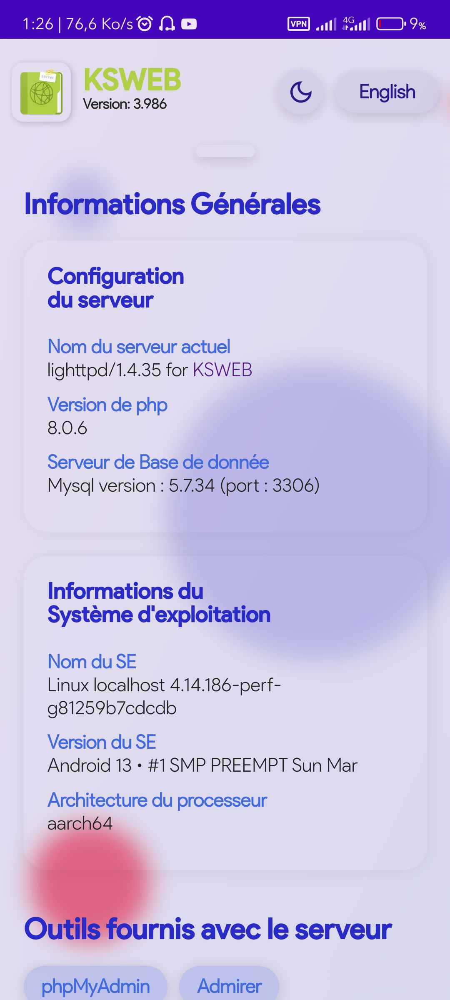
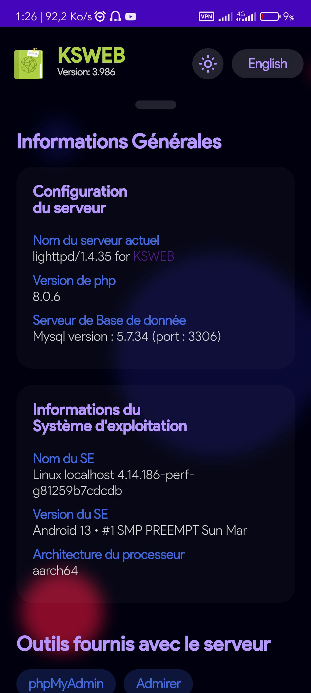

# Accueil du KSWEB 

Bénéficiez d'une interface d'accueil au serveur KSWEB pour Android comme sur wampServer sur Windows.

 

 

## A propos
Naviguer dans ksweb est facile oui, certe, mais pourquoi quitter le navigateur quand on peut parcourir directement l'ensemble de ses projets ?
- Vu d'ensemble des hôtes (avec details sur le projet et du dossier parent du projet pour ne oas faire confusion)
- Consulter ses projets dans un dossier personnalisé
- Support entier pour la version en Français et Anglais
- Choix du mode sombre ou clair (par défaut le mode sombre s'active automatiquement entre 18 et 08 heures)
- UI belle, et intuitive et facile à comprendre 
- Application web installable pour ne plus avoir à saisir tout le temps l'adresse sur son navigateur.

## Pré-requis
- Avoir ksweb installer sur son téléphone
- Avoir la licence pour pouvoir utiliser KSWEB 
- Ajouter une hôte pour vos différents projets et numérisé le port, vous en aurez besoin pour la configuration (facultatif)
- Récupérer le projet sur [mon GitHub](https://github.com/D-P-L-U-S/KSWEB).
- Une fois récupérer, rendez-vous sur votre stockage et copier le projet dans le dossier «htdocs». Si une alerte de remplacement du fichier survient, appuyez sur écrasé ou fusion ou tout équivalent.

## Presentation du projet 
- Repertoire racine
  1. **auth** (contient les fichiers de contrôle de la langue et du mode sombre/clair)
  2. **css** (contient les fichiers de style ainsi que le fichier manifest pour l'application de l'appli web)
  3. **img** (contient les fichiers images de favicon/logo de l'appli web ainsi que les captures d'écrans de l'appli web)
  4. **inc** (contient les fichiers à inclure. Ces fichiers sont requis car primordiaux et c'est dans ce dossier que les configurations se feront.)
  5. **phpinfo** (contient un script qui affichera les informations sur php)
  6. **polices** (contient les typographie utilisé pour le projet)
  7. *dnd.php* (fichier d'accueil du ksweb • il est recommandé de passer par le fichier **index.php**)
  8. *index.php* (fichier d'exécution de la page d'accueil du ksweb)
  9. **sw.js** (service worker • dans notre cas, ne fais rien en particulier , mais n'est pas à supprimer car serr pour l'installation de l'appli web).
  
## Configuration du projet 
  Afin que tout se passe au mieux, veuillez ouvrir le dossier **inc** du projet. Chaque fichier à des instructions claires. Néanmoins :
  1. Le fichier **db.php** vous demandera de fournir juste votre nom d'utilisateur phpMyAdmin et votre mot de passe (par défaut root et mot de passe vide sont utilisés)
  2. Le fichier **dir.php** vous permettra de configurer l'emplacement de votre dossier de projet pour pouvoir parcourir vos différents projets reunis dans un seul et meme dossier.
    - Imaginons que vous avez un dossier parent nommé A qui contient des sous dossiers
    - Ces sous dossiers constitue vos différents projets (ex: A1, A2, B1, B2 etc ...)
    - Le chemin du dossier que vous allez mentionné doit-être sois en chemin relatif (par rapport à ce projet c'est à dire par rapport à */storage/emulated/0/htdocs*) ou absolu (par rapport au répertoire racine du téléphone */*)
    - Pour mentionner en relatif, utiliser : *../../path/to/your/folder/projets*
    - Pour mentionner en absolu, utiliser : */storage/emulated/0/path/to/your/projet* 
  3. Le fichier **param.php** vous permettra de configurer l'heure d'activation automatique du mode sombre (qui peut aussi etre activé manuellement) mais aussi la version de votre ksweb car nous sommes dans l'impossibilité d'obtenir la version de ksweb installer (par défaut, ça sera la version la plus récente de Ksweb)
  4. Le fichier **setup.php** contient le script pour scanner votre dossier de projet mentionné dans **2.** de cette rubrique 
  5. Le fichier **vhosts.php** contient le script d'analyse de vos hosts en fonction du serveur que vous utilisez (**apache ou nginx ou lighttpd**). Vous n'aurez rien à faire dans ce fichier.
 
## Remerciements et contribution
Le projet étant open source, l'amélioration de ce dernier et vos suggestions ou vos critiques sont les bienvenus.

Pour ceux à qui ça va servir et qui sauront apprécier mon effort et mon travail, vos donations seront les bienvenus 🙂.

### Vos donations
1. BTC (BTC Segwit) : bc1q8r6dd8cx0lqe8hkxs3f5k56q2kqdw77s6hjmeq
2. USDT ou TRONX (TRC20) : TLJLJyJmnDQzuX9y4vtArDXU9Mqt5oLQRb
3. BNB (BEP20) : 0xc038c1bfe619b82638dca54c714bb607172cfecb

### Me contacter
https://t.me/justmeyourlove

## A vous de jouer ! 😉