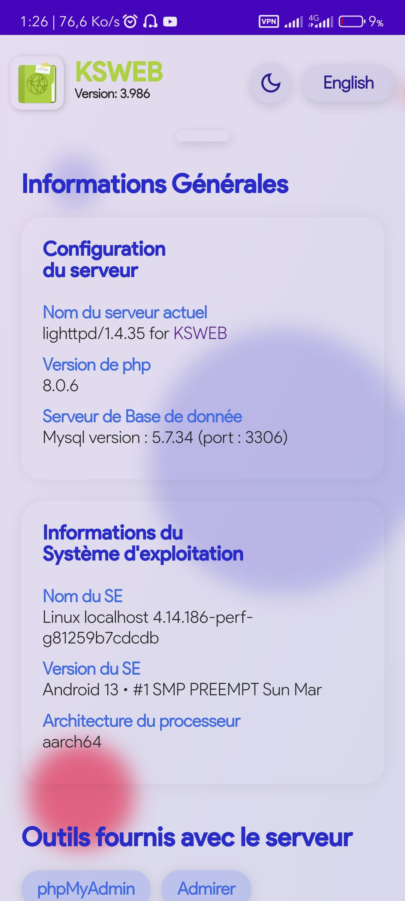

# KSWEB home reception

 Benefit from a start page interface to the KSWEB server for Android as on wampServer on Windows.

 

  
 

 

  
 

 ## About this project 
 Navigating in ksweb is easy yes, of course, but why leave the browser when you can directly browse all of your projects?
 - Overview of hosts (with details of the project and the project's parent folder to avoid confusion)
 - Consult your projects in a personalized folder
 - Full support for the French and English version
 - Choice of dark or light mode (by default dark mode activates automatically between 6 and 8 a.m.)
 - Beautiful UI, and intuitive and easy to understand
 - Installable web application so you no longer have to enter the address all the time in your browser.

 ## Prerequisites
 - Have ksweb installed on your phone
 - Have the license to be able to use KSWEB
 - Add a host for your different projects and scan the port, you will need it for configuration (optional)
 - Get the project on [my GitHub](https://github.com/D-P-L-U-S/KSWEB).
 - Once recovered, go to your storage and copy the project to the «htdocs» folder.  If a file replacement alert occurs, tap overwritten or merge or any equivalent.

 ## Project display
 - Root directory
   1. **auth** (contains language and dark/light mode control files)
   2. **css** (contains style files as well as manifest file for web app application)
   3. **img** (contains web app favicon/logo image files and web app screenshots)
   4. **inc** (contains the files to include. These files are required because they are essential and it is in this folder that the configurations will be done.)
   5. **phpinfo** (contains a script that will display php info)
   6. **fonts** (contains the typography used for the project)
   7. *dnd.php* (ksweb home file • it is recommended to go through the file **index.php**)
   8. *index.php* (ksweb homepage runtime file)
   9. **sw.js** (service worker • in our case, does nothing in particular, but should not be deleted because serr for installing the web app).
  
 ## Project Setup
   So that everything goes as well as possible, please open the **inc** folder of the project.  Each file has clear instructions.  Nevertheless :
   1. The **db.php** file will ask you to provide just your phpMyAdmin username and password (by default root and empty password are used)
   2. The **dir.php** file will allow you to configure the location of your project folder to be able to browse your different projects gathered in a single folder.
     - Imagine that you have a parent folder named A which contains subfolders
     - These subfolders constitute your different projects (ex: A1, A2, B1, B2 etc ...)
     - The path of the folder you are going to mention must be in relative path (relative to this project, i.e. relative to */storage/emulated/0/htdocs*) or absolute (relative to the root directory of the  phone */*)
     - To mention in relative, use: *../../path/to/your/folder/projects*
     - To mention in absolute, use: */storage/emulated/0/path/to/your/project*
   3. The **param.php** file will allow you to configure the automatic activation time of dark mode (which can also be activated manually) but also the version of your ksweb because we are unable to obtain  the version of ksweb to install (by default, it will be the most recent version of Ksweb)
   4. The **setup.php** file contains the script to scan your project folder mentioned in **2.** of this topic
   5. The **vhosts.php** file contains the analysis script for your hosts depending on the server you are using (**apache or nginx or lighttpd**).  You will have nothing to do in this file.
 
 ## Acknowledgments and contribution
 The project being open source, the improvement of the latter and your suggestions or criticisms are welcome.

 For those to whom it will be useful and who will appreciate my effort and my work, your donations will be welcome 🙂.

 ### Your donations
 1. BTC (BTC Segwit): bc1q8r6dd8cx0lqe8hkxs3f5k56q2kqdw77s6hjmeq
 2. USDT or TRONX (TRC20): TLJLJyJmnDQzuX9y4vtArDXU9Mqt5oLQRb
 3. BNB (BEP20): 0xc038c1bfe619b82638dca54c714bb607172cfecb

 ### Contact me
 [https://t.me/justmeyourlove](https://t.me/justmeyourlove)

 ## Up to you !  😉